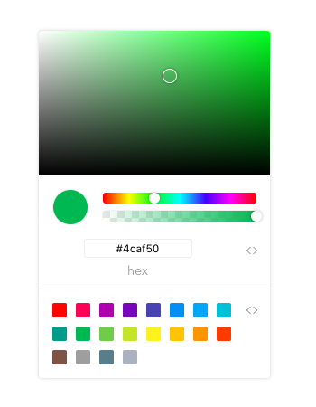

# one-colorpicker
A Chrome-style ColorPicker



## Install
```
$ npm install one-colorpicker
```

## Quick Start

```
import {ColorPicker, ColorPanel} from 'one-colorpicker'

Vue.use(ColorPanel)
Vue.use(ColorPicker)
```

## Props
### value
bind `v-model` return string, eg: '#f90', 'rgba(0, 255, 255, .4)'
```
<color-panel v-model="color"></color-panel>
```
## Events
#### change
```
<color-picker v-model="color" @change="change"></color-picker>
```
## Build Setup

generated by vue-cli

``` bash
# install dependencies
npm install

# serve with hot reload at localhost:8080
npm run dev

# build for production with minification
npm run build
```

For detailed explanation on how things work, consult the [docs for vue-loader](http://vuejs.github.io/vue-loader).

## License

Copyright (c) 2018 One View Licensed under the MIT license.